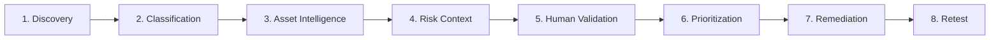
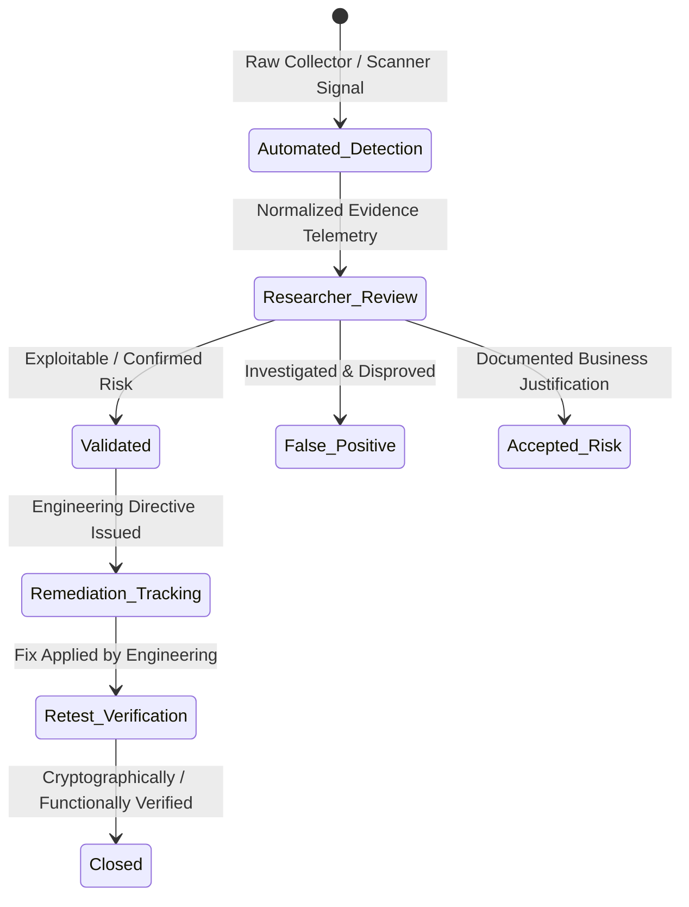
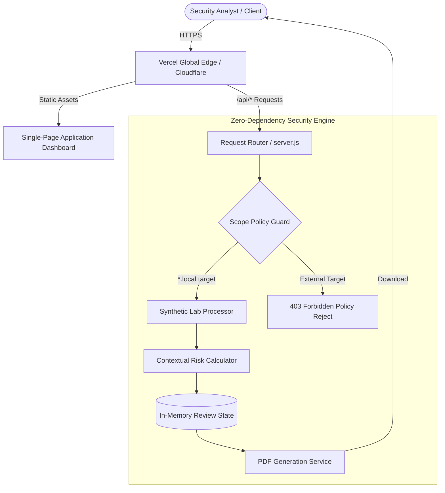

# Khashana Attack Surface Intelligence

### External Attack Surface Discovery & Vulnerability Prioritization

[](https://khashana-attack-surface-intelligenc.vercel.app/)
[](https://nodejs.org/)
[](#testing--quality-assurance)
[](#technology-stack)
[](#security-boundaries--disclaimer)

---

### 🌐 Quick Navigation

- 🚀 **[Live Interactive Demo](https://khashana-attack-surface-intelligenc.vercel.app/)**
- 📁 **[GitHub Repository](https://github.com/Khashana22/khashana-attack-surface-intelligence)**
- 📐 **[System Architecture](docs/architecture.md)**
- 🔬 **[Assessment Methodology](docs/methodology.md)**
- 📋 **[Northstar Labs Case Study](docs/freelance/case-study.md)**
- 💼 **[Freelance / Upwork Consulting Services](docs/freelance-service.md)**
- 🎯 **[Security Researcher Notes & Philosophy](docs/HUMAN-FINAL-TOUCH.md)**
- 📜 **[OpenAPI 3.1 Contract](docs/openapi.yaml)**

---

## Overview

**Khashana Attack Surface Intelligence (ASI)** is a security-researcher-oriented external attack surface discovery and vulnerability prioritization platform. Built by Web & API Security Researcher **Sayed Khashana**, it demonstrates how an organization's public perimeter can be systematically discovered, cataloged, contextualized, validated, prioritized, and reassessed.

The application is **publicly deployed on Vercel** and runs against a **controlled, synthetic security simulation** representing the fictional enterprise **Northstar Labs**. It explicitly proves that automated discovery should accelerate—rather than replace—human security judgment.

> *"Know your attack surface before an attacker does."*

---

## Why This Project Exists

Traditional vulnerability scanning creates critical pain points for modern engineering and security teams:
1. **Perimeter Blind Spots**: Ephemeral cloud instances, unannounced staging environments, and shadow IT expand the perimeter faster than spreadsheets or manual asset registries can track.
2. **Scanner Alert Fatigue**: Off-the-shelf automated scanners flood engineers with hundreds of uncontextualized issues, often conflating low-impact cosmetic anomalies with severe exploitable vulnerabilities.
3. **Missing Business Context**: A "Critical" CVSS vulnerability on an isolated internal development sandbox often distracts teams from a "Medium" misconfiguration on a customer-facing production authentication endpoint.

**Khashana ASI solves this** by coupling deterministic discovery with multi-factor risk weighting and a mandatory **Security Researcher Review** phase, ensuring engineering teams focus solely on validated, business-critical remediation.

---

## What This Demonstrates

- **Continuous Asset Discovery**: Discovery, classification, and inventory of exposed internet-facing hosts.
- **Topological Attack Surface Mapping**: Correlating hostnames, network services, tech stacks, and exposure pathways.
- **Context-Weighted Risk Scoring**: Scoring assets based on business criticality, environment tier, and authentication surface rather than raw finding counts.
- **Strict Separation of Detection & Validation**: Segregating raw scanner telemetry from researcher verification, exploitability analysis, and risk acceptance.
- **Baseline Change Detection**: Automated delta tracking between historical baselines and newly observed network perimeters.
- **Remediation & Retesting Verification**: Tracking issues through remediation, retesting, and verified closure.
- **Executive & Developer Deliverables**: Instant executive-ready PDF generation alongside interactive researcher controls.

---

## Security Assessment Workflow

The platform implements an 8-stage intelligence lifecycle:



1. **Discovery**: Enumerate hostnames, DNS records, IP addresses, open ports, and live protocols.
2. **Classification**: Categorize assets by tier (*Production, Staging, Development, Administrative*) and operational owners.
3. **Asset Intelligence**: Normalize technology stacks, TLS capabilities, and HTTP security response headers.
4. **Risk Context**: Weigh business impact and exposure factors into a normalized 0–100 asset risk score.
5. **Human Validation**: Security researcher investigates evidence, validates exploitability, and eliminates false positives.
6. **Prioritization**: Rank assets and findings in order of defensible business urgency.
7. **Remediation**: Deliver precise technical configuration directives to development teams.
8. **Retest**: Reassess perimeter changes against the baseline to prove risk elimination.

---

## Key Capabilities

- **Synthetic Attack Surface Discovery**: Normalized simulation of DNS, port, and HTTP reconnaissance.
- **Normalized Asset Inventory**: Authoritative asset ledger tracking hostnames, IPs, status, owners, and technologies.
- **Interactive Relationship Map**: Visual graph linking organization roots to environments, services, and open signals.
- **Exposure Analysis**: Flagging unauthenticated administrative portals, debug routes, and pre-production perimeter bleed.
- **Context-Aware Risk Model**: Multi-factor scoring algorithm incorporating environmental isolation and auth surface exposure.
- **Formal Finding Lifecycle**: Tracking findings through `Detected`, `Needs Validation`, `Validated`, `Accepted Risk`, `Remediated`, and `Closed`.
- **Security Researcher Queue**: Dedicated triage queue presenting unconfirmed signals for expert review.
- **Baseline Comparison & Change Detection**: Automated side-by-side delta view highlighting newly observed assets and resolved issues.
- **Executive PDF Reporting**: Built-in PDF generator producing board-level exposure summaries.
- **REST API & OpenAPI 3.1 Spec**: Complete documented API with strict input bounds and schema enforcement.

---

## Risk Prioritization Model

Rather than calculating risk by tallying generic vulnerability counts, Khashana ASI utilizes a **contextual risk formula** capped at 100 points:

$$\text{Asset Score} = \min\left(100, \; (\text{Criticality} \times 9) + \text{Env} + \text{Auth} + \sum (\text{Severity} \times \text{Confidence})\right)$$

### Factor Breakdown

| Risk Factor | Point Allocation | Security Rationale |
|---|---|---|
| **Business Criticality** | `0 – 45 points` | Evaluates organizational data sensitivity and business dependence (rated 1 to 5). |
| **Environment Tier** | `7 – 15 points` | Production (`15 pts`) and Administrative (`13 pts`) outrank Staging/Dev (`7 pts`) due to direct customer or operational impact. |
| **Authentication Surface** | `8 – 13 points` | Unauthenticated public surfaces (`13 pts`) present broader opportunistic threat exposure than authenticated entry points (`8 pts`). |
| **Open Finding Weight** | `0 – 30+ points` | Critical (`30 pts`), High (`20 pts`), Medium (`12 pts`), Low (`5 pts`), multiplied by confidence (`1.0` for High, `0.7` for Medium). |

*Note: Remediated, Closed, and False-Positive findings are automatically excluded from active risk scoring.*

---

## Security Researcher Workflow

A fundamental principle of this project is that **automation assists the security researcher; it does not replace human security judgment**:



The human researcher remains exclusively responsible for:
- **Exploitability Assessment**: Determining if a missing header or exposed route can be weaponized in practice.
- **Business Impact Analysis**: Understanding whether compensating network controls (e.g., WAF, IP whitelisting) mitigate theoretical exposure.
- **False-Positive Elimination**: Preventing development teams from burning engineering sprints on non-issues.
- **Remediation Verification**: Performing manual retesting before an issue is formally closed.

---

## Platform Architecture

The platform is designed with a lightweight, clean architecture that functions both as a standalone Node.js server and as a cloud-native serverless function:



---

## REST API Specification

The API is fully specified in [docs/openapi.yaml](docs/openapi.yaml) (OpenAPI 3.1):

| Endpoint | Method | Description | Scope / Policy |
|---|---|---|---|
| `/api/dashboard` | `GET` | Assessment overview, metrics, assets, findings, changes | Public demonstration |
| `/api/assets` | `GET` | Catalog of normalized assets with computed risk scores | Public demonstration |
| `/api/findings` | `GET` | Active security signals and validation states | Public demonstration |
| `/api/scans` | `POST` | Process discovery fixtures | Strictly requires `target: "*.local"` |
| `/api/findings/{id}/review` | `POST` | Record researcher validation decision & notes | Input-bounded state transition |
| `/api/reports/executive.pdf` | `GET` | Generate and download executive PDF report | Instant binary streaming |

---

## Case Study: Northstar Labs Engagement

Review the complete simulated engagement narrative in **[docs/freelance/case-study.md](docs/freelance/case-study.md)**.

- **Client**: Northstar Labs (fictional SaaS enterprise)
- **Challenge**: 50% perimeter growth within one sprint; untracked pre-production staging and development endpoints exposed to the internet.
- **Findings Investigated**:
  - `SK-ASM-002` (High): Development server exposed with active `/__debug` route on `dev.northstar.local:3000`.
  - `SK-ASM-001` (Medium): Absent Content Security Policy on `staging.northstar.local`.
  - `SK-ASM-003` (Medium): Legacy TLS 1.1 support on staging infrastructure.
  - `SK-ASM-004` (Low): Privileged administrative login portal on `admin.northstar.local`.
- **Outcome**: Critical containment of development debug route, CSP header integration in CI/CD pipeline, and verified remediation of legacy TLS protocols.

---

## Methodology & Security Documentation

- 🔬 **[Assessment Methodology](docs/methodology.md)**: 7-stage repeatable methodology balancing automation speed with human validation rigor.
- 📐 **[System Architecture](docs/architecture.md)**: Component topology, state machine diagrams, and security boundaries.
- 🎯 **[Human Final Touch & Researcher Philosophy](docs/HUMAN-FINAL-TOUCH.md)**: Sayed Khashana's security philosophy, observations, and manual testing roadmap.
- 💼 **[Freelance Security Consulting Scope](docs/freelance-service.md)**: Client-ready service descriptions for Upwork and advisory engagements.

---

## Technology Stack

The project adheres to a strict zero-dependency philosophy for core execution:

| Layer | Technologies Used | Rationale |
|---|---|---|
| **Core Engine & Backend** | **Node.js 22 LTS** (`node:http`, `node:crypto`, `node:fs`, `node:path`, `node:test`) | Zero external npm runtime dependencies; ultra-fast startup and immune to npm supply-chain vulnerabilities. |
| **Frontend Console** | **Vanilla JavaScript (ES6+)**, Semantic HTML5, CSS3 | Dark security operations theme; zero frontend framework overhead, 100% responsive, WCAG 2.1 AA accessible. |
| **Deployment & Serverless** | **Vercel Serverless Functions** (`api/index.js`), Vercel Edge CDN | Global edge caching for static assets, automated CI/CD continuous deployment. |
| **Optional Persistence** | **PostgreSQL 16 Alpine**, Docker & Docker Compose (`database/schema.sql`) | Production-ready relational schema with audit trails and explicit scope authorization flags. |
| **API Contract & CI** | **OpenAPI 3.1.0**, GitHub Actions (`.github/workflows/ci.yml`) | Standardized contract documentation and automated quality gates. |

---

## Project Structure

```text
├── .github/
│   └── workflows/
│       └── ci.yml               # Automated linting, test execution, and Docker build
├── api/
│   └── index.js                 # Serverless function entrypoint for Vercel deployment
├── database/
│   └── schema.sql               # PostgreSQL schema with audit logging and scope flags
├── docs/
│   ├── architecture.md          # Data flow, state machine, and component design
│   ├── freelance-service.md     # Upwork / client-facing service catalog & scoping
│   ├── HUMAN-FINAL-TOUCH.md     # Researcher philosophy, validation triage & manual tests
│   ├── methodology.md           # 7-stage security assessment methodology
│   ├── openapi.yaml             # OpenAPI 3.1 REST API contract definition
│   └── freelance/
│       └── case-study.md        # Detailed Northstar Labs engagement narrative
├── public/
│   ├── app.js                   # Client-side reactivity, search, and review modal handler
│   ├── index.html               # Accessible dark cybersecurity intelligence dashboard
│   ├── overrides.css            # Responsive layout constraints and focus-visible outlines
│   └── styles.css               # Professional dark security operations design system
├── test/
│   └── server.test.js           # Deterministic unit and integration tests (node:test)
├── .env.example                 # Environment configuration template
├── .gitignore                   # Excludes credentials, IDE files, and temporary caches
├── Dockerfile                   # Alpine container specification (node:22-alpine)
├── docker-compose.yml           # Isolated local-lab container orchestration
├── package.json                 # Project configuration, test scripts, and engine constraints
├── package-lock.json            # Deterministic dependency lockfile
├── server.js                    # Core HTTP server, risk algorithm, and PDF generator
└── vercel.json                  # Cloud routing and API path rewrite rules
```

---

## Local Development vs. Live Deployment

### 1. Live Public Demonstration
- **URL**: **[https://khashana-attack-surface-intelligenc.vercel.app/](https://khashana-attack-surface-intelligenc.vercel.app/)**
- Instant browser access; no installation or credentials required.
- Demonstrates real-time asset exploration, relationship mapping, and researcher validation.

### 2. Local Environment Setup

#### Prerequisites
- Node.js 22 LTS (or 20+)
- (Optional) Docker & Docker Compose

```bash
# Clone the repository
git clone https://github.com/Khashana22/khashana-attack-surface-intelligence.git
cd khashana-attack-surface-intelligence

# Start the standalone server (Zero npm install needed)
npm start

# Access the local dashboard
# Open http://localhost:3000 in your browser
```

#### Running with Docker Compose (Optional PostgreSQL)

```bash
docker compose up --build
```

The container network is strictly isolated internally; the platform will run on port 3000 with a PostgreSQL 16 database initialized with the schema.

---

## Testing & Quality Assurance

The project includes an automated test suite leveraging Node.js native test runner (`node:test`) with **100% pass rate**:

```bash
# Execute unit and integration tests
npm test

# Run syntax verification and linting
npm run lint
```

### Verified Test Cases
1. `risk model is deterministic and bounded` — Verifies risk formulas remain strictly within 0–100 bounds.
2. `dashboard is available` — Confirms `/api/dashboard` returns 200 OK with valid metrics.
3. `scan policy blocks arbitrary internet targets` — Asserts that arbitrary internet scans are blocked with HTTP 403.
4. `local fixture target is accepted without scanning` — Verifies `.local` lab fixture normalization.
5. `review state validates input` — Tests validation rejection on malformed reviewer states.
6. `api serverless entrypoint exports callable function` — Validates Vercel cloud function adapter.
7. `root / serves dashboard html` — Confirms root route serves dashboard HTML.

---

## Security Boundaries & Disclaimer

- **No Unauthorized Scanning**: This platform does **NOT** scan external third-party networks or unauthorized infrastructure. The scan endpoint strictly blocks any target outside the `.local` policy.
- **Synthetic Demonstration**: All organizations, hostnames, IP addresses, vulnerabilities, and personnel names are entirely simulated for training and portfolio presentation purposes.
- **Legal Notice**: Real-world penetration testing, attack surface mapping, and vulnerability assessments require written consent from infrastructure owners before any technical activities commence.

---

## Author

**Sayed Khashana**  
*Web & API Security Researcher*  
- **GitHub**: [github.com/Khashana22](https://github.com/Khashana22)  
- **Portfolio Repository**: [khashana-attack-surface-intelligence](https://github.com/Khashana22/khashana-attack-surface-intelligence)  
- **Live Demo**: [khashana-attack-surface-intelligenc.vercel.app](https://khashana-attack-surface-intelligenc.vercel.app/)  

