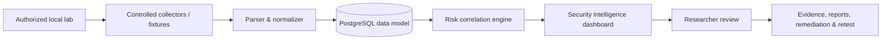
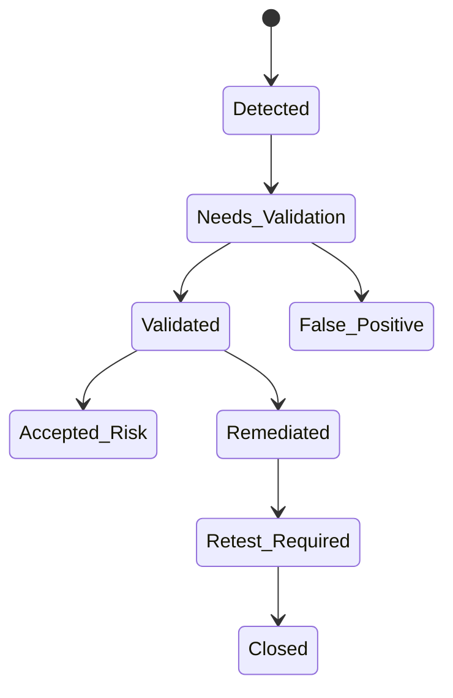

# Architecture

## Platform architecture

The included runnable demo uses deterministic fixture data and an in-memory reviewer state so it can run without dependencies. `database/schema.sql` is the PostgreSQL persistence model for the Docker deployment path.

## Finding lifecycle

## Change detection

The baseline consists of asset identity, services, technologies, HTTP/TLS behavior, auth surfaces, findings, and risk score. A new scan is diffed against that state to create additions, removals, and changed observations. The dashboard demonstrates two newly observed synthetic assets and one remediated TLS finding.

## API design

The REST contract is available in [openapi.yaml](openapi.yaml). Mutating operations should require authenticated, authorized users in production; the portfolio demo deliberately does not claim to implement a production identity provider.
