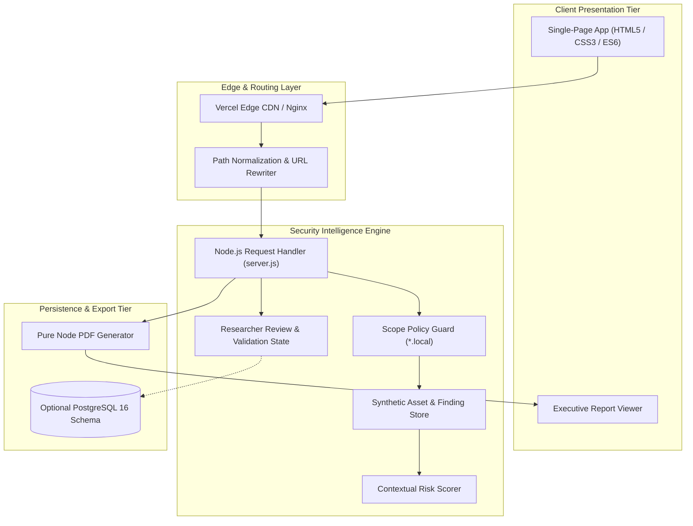
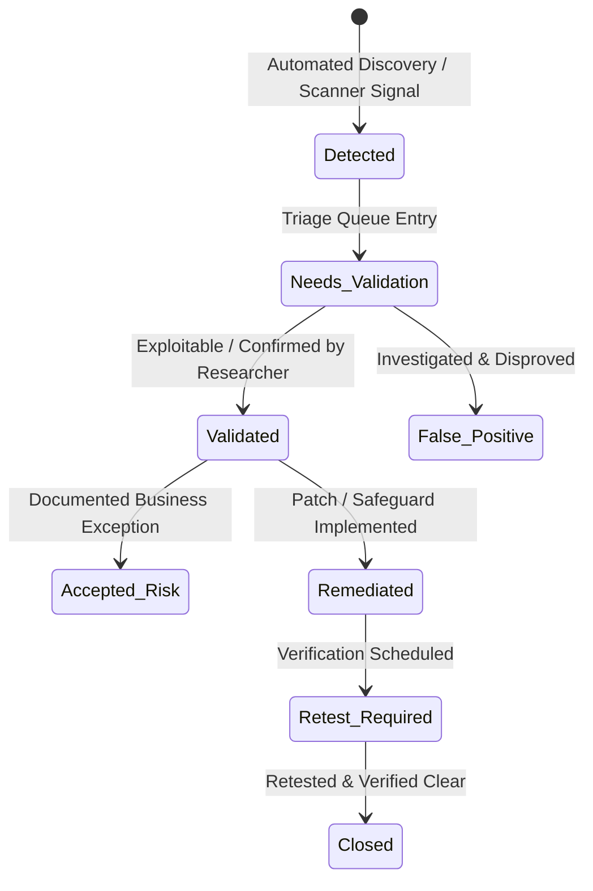

# System Architecture & Technical Design

**Platform**: Khashana Attack Surface Intelligence  
**Author**: Sayed Khashana — Web & API Security Researcher  

---

## 1. High-Level Platform Architecture

The platform is designed to operate seamlessly in two execution environments:
1. **Local & Containerized Runtime**: Standalone Node.js HTTP server with zero runtime npm dependencies, containerized via Alpine Docker image with optional PostgreSQL 16 persistence.
2. **Cloud Serverless Runtime**: Deployed to Vercel via `api/index.js` serverless function adapter, with static assets served via global edge CDN.

---

## 2. Security Researcher Finding Lifecycle

Findings progress through an explicit state machine that segregates automated scanner detection from human security validation and verified remediation:

---

## 3. Attack Surface Change Detection Engine

The baseline model retains:
- Complete hostname and IP bindings.
- Port and service discovery profiles.
- Technology stacks and version fingerprints.
- Observed HTTP headers and TLS protocol/cipher capabilities.
- Exposed authentication endpoints.
- Active risk score.

When an authorized discovery fixture is ingested, the engine diffs the current state against the historical baseline to produce:
1. **New Assets**: Unannounced subdomains or services (e.g., `staging.northstar.local`, `dev.northstar.local`).
2. **Decommissioned Assets**: Previously observed hosts no longer responding.
3. **Resolved Vulnerabilities**: Mitigated findings verified via negative test fixtures (e.g., `SK-ASM-003`).

---

## 4. Security Boundaries & Hardening Controls

- **Zero Third-Party Scanning**: Mutating discovery endpoints (`POST /api/scans`) strictly require targets ending in `.local`. All arbitrary internet targets are rejected with HTTP 403 Forbidden.
- **Path Traversal Protection**: Static asset serving strictly normalizes requested filepaths using `path.normalize()` and asserts that resolved paths remain rooted within the `/public` directory.
- **Enterprise Security Headers**: Every HTTP response is hardened with:
  - `Content-Security-Policy: default-src 'self'; style-src 'self' 'unsafe-inline'; script-src 'self'; img-src 'self' data:`
  - `X-Content-Type-Options: nosniff`
  - `X-Frame-Options: DENY`
  - `Referrer-Policy: no-referrer`
  - `Permissions-Policy: geolocation=(), microphone=(), camera=()`
- **Zero Runtime Dependencies**: The core engine uses exclusively Node.js native standard libraries (`node:http`, `node:fs`, `node:path`, `node:crypto`, `node:test`), eliminating supply-chain vulnerabilities.

