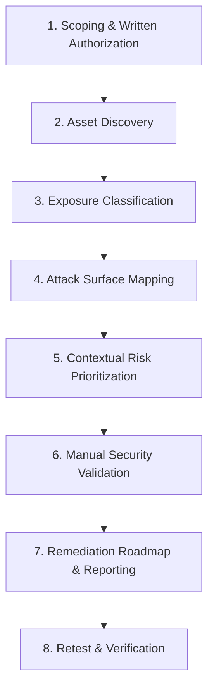

# Cybersecurity Consulting Services: External Attack Surface Assessment

**Consultant**: Sayed Khashana — Web & API Security Researcher  
**Specialization**: External Attack Surface Intelligence, Web Application Penetration Testing & API Security  
**Platforms**: Upwork · Direct Security Advisory · Freelance Engagements  

---

## 1. Overview for Prospective Clients

Before malicious actors map your infrastructure, you need an authoritative, researcher-validated inventory of your external footprint. Many organizations suffer security breaches not through hardened production applications, but through forgotten staging servers, misconfigured cloud assets, unauthenticated debug routes, and perimeter configuration drift.

I provide **External Attack Surface Assessments** designed to identify, analyze, and prioritize external risks before they can be exploited.

> **Important Prerequisite**: All real-world client security assessments require **formal written authorization**, explicit rules of engagement, and a strictly bounded target scope document.

---

## 2. Core Service Offerings

### Service A: External Attack Surface Assessment (Primary Offering)
- **Target Audience**: Startups, SaaS providers, and growing businesses preparing for audits (SOC 2, ISO 27001), compliance checks, or enterprise penetration testing.
- **Scope**: Entire organizational domain perimeter (e.g., `*.yourdomain.com`).
- **Deliverables**:
  1. Authoritative asset inventory (domains, subdomains, IPs, cloud providers, technologies).
  2. Visual attack surface relationship map.
  3. Exposure analysis (unprotected administrative portals, dev/staging leakage, outdated services).
  4. Context-weighted risk prioritization matrix.
  5. Executive summary and technical remediation roadmap.

### Service B: Web Application & API Penetration Testing
- **Target Audience**: Organizations with defined web applications or REST/GraphQL APIs requiring deep vulnerability validation.
- **Scope**: In-depth manual and automated testing aligned with the OWASP Top 10 and OWASP API Security Top 10.
- **Deliverables**: Validated Proof-of-Concept (PoC) steps, business impact analysis, CVSS 3.1 contextual scoring, and specific engineering remediation directives.

### Service C: Remediation Verification & Security Retest
- **Target Audience**: Clients who have implemented security patches and require independent third-party verification.
- **Scope**: Re-testing all previously identified findings against the original baseline.
- **Deliverables**: Cryptographic/raw evidence of closed findings, residual risk assessment, and an updated executive certificate of retest.

---

## 3. The 8-Stage Client Assessment Workflow

1. **Scoping & Authorization**: Define target domains, exclusion lists, emergency contacts, and testing windows under a signed mutual agreement.
2. **Asset Discovery**: Passive and active reconnaissance to uncover all internet-reachable assets, subdomains, DNS records, and cloud infrastructure.
3. **Exposure Classification**: Attribute technologies, software versions, open ports, transport security configurations, and operational owners.
4. **Attack Surface Mapping**: Correlate relationships between hostnames, backend microservices, third-party CDNs, and authentication entry points.
5. **Risk Prioritization**: Calculate composite risk based on business criticality, exposure tier, and authentication surface—not generic vulnerability counters.
6. **Manual Security Validation**: Investigate alerts to eliminate false positives and establish verified exploitability.
7. **Evidence Collection & Reporting**: Compile executive summaries for non-technical stakeholders and granular technical proofs for developers.
8. **Retest & Reassessment**: Verify applied fixes and produce a clean post-remediation report.

---

## 4. Why Clients Hire Sayed Khashana

| Feature | Automated Scanners Alone | Sayed Khashana's Approach |
|---|---|---|
| **Accuracy** | 30–50% false positive rate | **Zero false positives delivered** (human-validated) |
| **Context** | Generic CVSS scores | **Custom risk scoring** based on your business model |
| **Remediation** | Generic copy-paste advice | **Exact code snippets, nginx configs, and CI/CD checks** |
| **Communication** | 100-page bloated PDF dumps | **Concise, executive summaries and developer-ready tasks** |
| **Follow-up** | Re-run scan with same noise | **Targeted retest** with verification evidence |

---

## 5. Typical Engagement Formats & Timelines

- **Rapid Perimeter Review**: 2–3 business days. Ideal for quick pre-funding or pre-audit health checks.
- **Full Attack Surface Assessment**: 1–2 weeks. Comprehensive discovery, mapping, and manual validation.
- **Continuous Quarterly Assessment**: Ongoing quarterly baseline diffing to catch shadow IT before adversaries do.

To discuss an authorized assessment for your infrastructure, connect via Upwork or GitHub:  
👉 **[github.com/Khashana22](https://github.com/Khashana22)**

