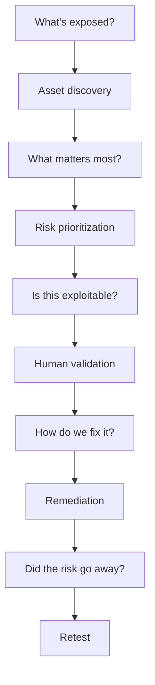

# Freelance service positioning

## External Attack Surface Assessment

For organizations that need a clear view of externally exposed web assets before commissioning a deeper penetration test. Deliverables can include an authorized asset inventory, exposure map, technology observations, prioritized signals, and an executive/technical report.

## Web Vulnerability Assessment

Focused analysis of agreed web applications and APIs, with evidence, researcher validation, and remediation recommendations. Client input: written scope, test window, contacts, and authenticated access where relevant.

## External Security Review

A time-bounded posture review that correlates known assets, exposure, configuration signals, and business context. It is not a substitute for a full penetration test or continuous monitoring unless those services are explicitly scoped and technically supported.

## Security Retest

Verification of agreed remediation actions against the original authorized scope. Deliverables identify what was retested, current status, and any residual risk.

## Client journey

