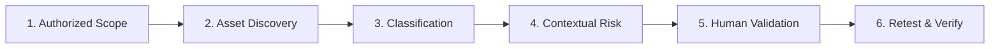

# Case Study: External Attack Surface Discovery & Remediation Validation

**Client**: Northstar Labs (Fictional Organization · Simulated Training Engagement)  
**Lead Researcher**: Sayed Khashana — Web & API Security Researcher  
**Service Type**: External Attack Surface Assessment & Vulnerability Prioritization  
**Target Scope**: `*.northstar.local` (Controlled synthetic security laboratory)  

---

## 1. Executive Summary

Northstar Labs, a growing B2B SaaS organization, engaged Sayed Khashana to conduct an **External Attack Surface Assessment** prior to an upcoming SOC 2 Type II audit and enterprise penetration test. The objective was to discover internet-facing assets, identify shadow IT and configuration drift, correlate exposure with business criticality, and validate real-world exploitability.

The engagement identified a **50% attack surface expansion** (from 4 baseline hosts to 6 observed hosts) within a single release cycle, uncovering an exposed development debug route and missing browser security controls on pre-production environments. Remediation guidance was delivered, and follow-up retesting validated the elimination of legacy TLS protocol vulnerabilities.

---

## 2. The Challenge: Perimeter Drift & Blind Spots

As Northstar Labs accelerated product delivery, development and platform teams deployed ephemeral staging and testing environments without consistent security oversight. Leadership faced three critical challenges:

1. **Unknown Asset Inventory**: Security teams lacked an authoritative, real-time map of publicly reachable subdomains, technologies, and IP allocations.
2. **Scanner Fatigue & False Alarms**: Automated commercial vulnerability tools generated hundreds of uncontextualized alerts without distinguishing between exploitable flaws and harmless configuration anomalies.
3. **Unprioritized Remediation**: Engineering teams could not determine whether fixing an absent header on an internal-facing host was more urgent than addressing an unauthenticated debug interface on a development host.

---

## 3. The 6-Stage Assessment Methodology

1. **Authorized Scope Definition**: Boundaries were formally locked to `*.northstar.local`, ensuring testing was strictly confined to approved lab assets.
2. **Automated Discovery**: DNS enumerations, service fingerprinting, and HTTP/TLS inspection identified 6 live endpoints across production, staging, development, and administrative tiers.
3. **Asset Classification**: Each asset was cataloged with environment tier, business criticality (1-5), technological stack, and authentication surface presence.
4. **Contextual Risk Modeling**: Rather than simply counting vulnerabilities, risks were scored using a multi-factor formula combining criticality (0–45 pts), environment exposure (7–15 pts), authentication surface exposure (8–13 pts), and severity-confidence products.
5. **Security Researcher Validation**: Raw scanner detections were manually verified. A human researcher investigated evidence, drafted exploitability notes, and eliminated false positives.
6. **Remediation & Retesting**: Engineering was provided with exact remediation steps. Follow-up retesting verified that corrective controls were applied effectively.

---

## 4. Assessment Findings & Triage Breakdown

| Finding ID | Title | Target Asset | Severity | Initial State | Final Validated State |
|---|---|---|---|---|---|
| **SK-ASM-002** | Development server exposed with debug metadata | `dev.northstar.local:3000/__debug` | **High** | Detected | **Needs Validation** |
| **SK-ASM-001** | Missing Content Security Policy on staging application | `staging.northstar.local` | **Medium** | Detected | **Validated** |
| **SK-ASM-003** | TLS configuration allows legacy protocol on staging | `staging.northstar.local` | **Medium** | Remediated | **Verified Closed** |
| **SK-ASM-004** | Administrative login surface identified | `admin.northstar.local/login` | **Low** | Detected | **Accepted Risk** |

### Detailed Analysis of Key Findings

#### Finding 1: Exposed Development Debug Interface (`SK-ASM-002`)
- **Observation**: `dev.northstar.local:3000` was discovered responding to external HTTP requests, revealing Vite/Node development server artifacts and an active `/__debug` endpoint.
- **Human Validation Analysis**: The automated discovery flagged the endpoint. The security researcher prioritized this as the **highest triage urgency** because debug endpoints frequently expose runtime memory, environment variables, or database connection strings.
- **Remediation Plan**: Immediately restrict port 3000 access at the security group level and ensure development servers bind only to `127.0.0.1`.

#### Finding 2: Missing Content Security Policy (`SK-ASM-001`)
- **Observation**: HTTP response headers from `staging.northstar.local` lacked a `Content-Security-Policy` header.
- **Human Validation Analysis**: Validated directly against HTTP response evidence. While staging does not host production customer data, staging environments frequently share authentication providers or OAuth callbacks with production, creating potential cross-origin pivot risks.
- **Remediation Plan**: Inject baseline CSP headers into the reverse proxy configuration (`nginx`) and enforce policy compliance in CI/CD pipeline tests.

#### Finding 3: Legacy TLS Protocol Remediation (`SK-ASM-003`)
- **Observation**: Historical baseline scans indicated support for TLS 1.1 on staging infrastructure.
- **Human Retest Verification**: During the reassessment phase, TLS negotiation was probed with modern and legacy cipher suites. The researcher verified that TLS 1.0 and 1.1 were rejected, confirming successful remediation.

---

## 5. Measurable Outcomes & Client Impact

1. **Complete Visibility**: Provided Northstar Labs with an authoritative inventory of 6 mapped assets, detailing tech stacks (Next.js, Express, React, Vite, nginx) and operational owners.
2. **Zero False Positives Delivered**: By applying researcher validation before final reporting, engineering wasted zero hours chasing irrelevant scanner alerts.
3. **Defensible Risk Prioritization**: The security team received clear justification for prioritizing the isolation of `dev.northstar.local` over routine static header updates.
4. **Verified Remediation Evidence**: The client received executive-ready PDF documentation and cryptographic evidence confirming the elimination of legacy TLS protocols.

---

> **Disclaimer**: *Northstar Labs is a fictional organization. All domain names, IP addresses, vulnerability signals, and assessment data presented in this case study are synthetic local-lab fixtures created for portfolio demonstration purposes.*

