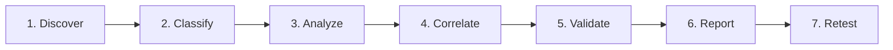

# Security Assessment Methodology

**Author**: Sayed Khashana — Web & API Security Researcher

A professional external attack surface assessment combines rapid, repeatable automated discovery with rigorous human security validation. This document defines the operational methodology implemented in the Khashana Attack Surface Intelligence platform.

---

## 1. Scope & Legal Authorization

Every legitimate security assessment begins with explicit written authorization defining:
- Permitted target domains, CIDR ranges, and specific endpoints.
- Explicit out-of-scope targets (e.g., third-party SaaS dependencies, shared hosting infrastructure, payment processors).
- Testing window constraints and emergency contacts.

In this portfolio application, discovery routes are bounded by policy to `.local` lab targets (`*.northstar.local`), demonstrating how automated systems must enforce scope constraints to prevent unauthorized scanning.

---

## 2. The 7-Stage Intelligence Lifecycle

1. **Discover**: Enumerate domain hierarchy, DNS records, public IP spaces, open ports, and HTTP/TLS endpoints across the target perimeter.
2. **Classify**: Identify environment tier (Production, Staging, Development, Administrative), service types, technological components, and organizational ownership.
3. **Analyze**: Normalize disparate scanner outputs, banner grabs, and response headers into a unified asset intelligence schema.
4. **Correlate**: Calculate multi-dimensional risk scores. Business criticality, environmental isolation, and exposed authentication surfaces are weighed alongside raw vulnerability severity.
5. **Validate**: A security researcher examines technical evidence to verify real-world exploitability, eliminate false positives, and document contextual impact.
6. **Report**: Deliver concise executive risk summaries for non-technical leadership alongside detailed technical remediation guidance for engineers.
7. **Retest**: Diff new infrastructure observations against historical baselines to verify remediation and detect unauthorized surface drift.

---

## 3. Core Principle: Detection Is Not Validation

Commercial automated scanners frequently misinterpret benign responses as critical flaws or overlook high-risk exposures due to lack of business context.

The Khashana ASI platform strictly enforces a separation between:
- **Automated Detection Record**: Immutable raw telemetry captured by scanning mechanisms (timestamps, endpoints, headers, banners).
- **Researcher Review & Validation**: Human-editable decisions, exploitability notes, and formal status transitions (`Needs Validation` → `Validated` | `False Positive` | `Accepted Risk`).

---

## 4. Controlled Synthetic Evidence

The assessment data featured in this platform represents a controlled synthetic security simulation for the fictional organization **Northstar Labs**. All network fixtures, response headers, and risk metrics are designed to demonstrate a realistic assessment workflow without scanning third-party infrastructure.

